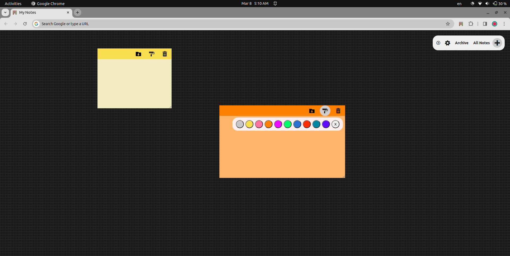

# New Tab Notes - Sticky Notes app for Chrome

Replace your new tab page with a minimalistic Sticky Notes board using this Chrome extension. Keep your important notes in front of you every time you open a new tab.

## Features

- **Minimal Design:** Enjoy a clutter-free new tab page with a simple and minimalistic Sticky Notes board.
- **Archive:** Archive your notes to keep a clean workspace without losing important information.
- **Customizable Colors:** Personalize your Sticky Notes with customizable colors to suit your style.

## Installation

1. Clone this repository or download the ZIP file.

   ```bash
   git clone https://github.com/your-username/sticky-notes-chrome-extension.git
   ```

2. Open Chrome and navigate to `chrome://extensions/`.

3. Enable "Developer mode" in the top right corner.

4. Click on "Load unpacked" and select the directory where you cloned or extracted the extension files.

5. The Sticky Notes Tab extension will be added to your Chrome browser.

## Usage

Once the extension is installed, every new tab will display a clean Sticky Notes board. Click on the '+' icon to add a new note. Customize the note's color and content according to your preferences.

To archive a note, click on the archive icon in the top right corner of the note. Archived notes can be accessed by clicking on the 'Archive' button.

## Customization

Customize the colors of your Sticky Notes by clicking on the color palette icon. Choose from a variety of colors to make your notes visually appealing and organized.

## Feedback

If you encounter any issues or have suggestions for improvement, feel free to [open an issue](https://github.com/your-username/sticky-notes-chrome-extension/issues). We appreciate your feedback!

## License

This project is licensed under the [MIT License](LICENSE.md).

---

**Note:** This is a minimalistic Chrome extension that aims to provide a distraction-free environment for managing your notes on the new tab page. We hope you find it useful!
Make sure to replace "your-username" with your actual GitHub username and adjust any other details as needed for your specific extension.
